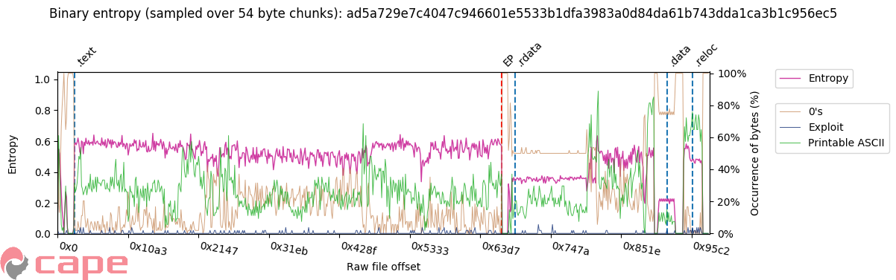
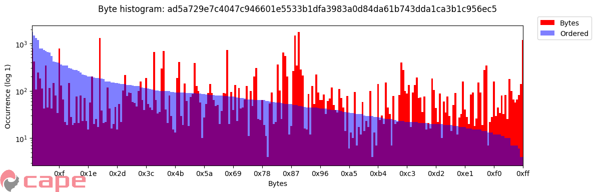

# binGraph.py
Simple tool to graph files for quick analysis

Allows you to create matplotlib graphs to represent different aspects of a file (usually malware). Focusing on entropy graphs

Given a file(s) (with ```--file```) different graphs can be generated (e.g. ```bin_ent```, ```bin_hist``` etc.) or ```all``` can be used to generate all the graphs available for that file.

Below are the ```--help ``` options:

```
$ python binGraph.py --help
usage: binGraph.py [-h] -f malware.exe [malware.exe ...] [-r] [-] [-p PREFIX]
                   [-d /data/graphs/] [--format png] [--figsize # #]
                   [--dpi 100] [--showplt] [--blob] [-v]
                   {all,bin_ent,bin_hist} ...

positional arguments:
  {all,bin_ent,bin_hist}
                        Graph type to generate

optional arguments:
  -h, --help            show this help message and exit
  -f malware.exe [malware.exe ...], --file malware.exe [malware.exe ...]
                        Give me a graph of this file. See - if this is the
                        only argument specified.
  -r, --recurse         If --file is a directory, add files recursively
  -                     *** Required if --file or -f is the only argument
                        given before a graph type is given (it's greedy!).
                        E.g. "binGraph.py --file mal.exe - bin_ent"
  -p PREFIX, --prefix PREFIX
                        Saved graph output filename (without extension)
  -d /data/graphs/, --save_dir /data/graphs/
                        Where to save the graph files
  --format png          Graph output format
  --figsize # #         Figure width and height in inches
  --dpi 100             Figure dpi
  --showplt             Show plot interactively (disables saving to file)
  --blob                Do not intelligently parse certain file types. Treat
                        all files as a binary blob. E.g. don't add PE entry
                        point or section splitter to the graph
  -v, --verbose         Print debug information to stderr
```

## Binary Entropy - bin_ent
Shows the entropy over certain sized chunked samples of the binary file. The sample size is scaled to the ```--chunks``` option (defaults to 750). More chunks give mode detail, but can get messy! The ```--ibytes``` option provides a method to highlight certain bytes and their occurence within that sample set. This often has direct reflection to why entropy goes up or down - lots of 0's? Entropy goes down, and 0's go up!


!MALWARE! Sample from: https://cape[.]contextis[.]com/file/CAPE/9472/ad5a729e7c4047c946601e5533b1dfa3983a0d84da61b743dda1ca3b1c956ec5/
```
$ python binGraph.py bin_ent --help
usage: binGraph.py bin_ent [-h] [-c 750] [--ibytes ["{\"0's\": [0], \"Exploit\": [44, 144] }"]]

optional arguments:
  -h, --help            show this help message and exit
  -c 750, --chunks 750  Defines how many chunks the binary is split into (and
                        therefore the amount of bytes submitted for shannon
                        sampling per time). Higher number gives more detail
  --ibytes ["{\"0's\": [0] , \"Exploit\": [44, 144] }"]
                        JSON of bytes to include in the graph. To disable this
                        option, either set the flag without an argument, or
                        set value to "{}"
```

## Binary Histogram - bin_hist
Provides an insight into the occurence of all bytes in the file. Two graphs are shown, the red graph shows the bytes 0x00 to 0xFF in order. The blue graph shows the same bytes, ordered by count, this shows the overall distribution.


!MALWARE! Sample from: https://cape[.]contextis[.]com/file/CAPE/9472/ad5a729e7c4047c946601e5533b1dfa3983a0d84da61b743dda1ca3b1c956ec5/
```
$ python binGraph.py bin_hist --help
usage: binGraph.py bin_hist [-h] [--no_zero] [--width 1] [--no_log]
                            [--no_order]

optional arguments:
  -h, --help  show this help message and exit
  --no_zero   Remove 0x00 from the graph, sometimes this blows other results
              due to there being numerous amounts - also see --no_log
  --width 1   Sample width
  --no_log    Do _not_ apply a log scale to occurance axis
  --no_order  Remove the ordered histogram - It shows overall distribution
              when on
```

# To do:

- Allow user to explicitly define colour to be used for each ```--ibytes``` value.
- Place graph generation into their own modules
