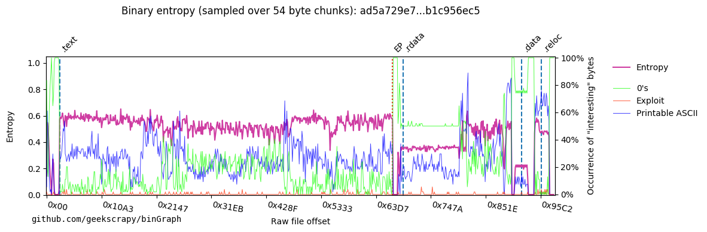
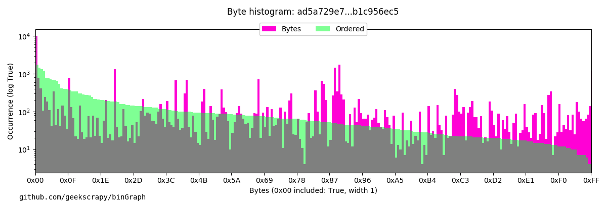

# binGraph.py
A tool to graph files for quick visual analysis of binary files

Feel free to use this project (in its entirety) in other tools, and please provide attribution back to the project.

Creates matplotlib graphs to represent different aspects of a file (usually malware). Focusing on entropy.

Given a file(s) (with ```--file```) different graphs can be generated (e.g. ```ent```, ```hist``` etc.) or ```all``` can be used to generate all the graphs available.

Below are the ```--help ``` options:

```
$ python binGraph.py --help
usage: binGraph.py [-h] -f malware.exe [malware.exe ...] [-r] [-] [--prefix]
                   [--out /data/graphs/] [--json] [--graphtitle "file.exe"]
                   [--showplt] [--format png] [--figsize # #] [--dpi 100]
                   [--blob] [-v]
                   {all,hist,ent} ...

positional arguments:
  {all,hist,ent}        Graph type to generate. Graphs can also be
                        individually generated by running the in isolation:
                        python graphs/ent/graph.py -f file.bin

optional arguments:
  -h, --help            show this help message and exit
  -f malware.exe [malware.exe ...], --file malware.exe [malware.exe ...]
                        Give me a graph of this file. Provide a list of files
                        with the "@files.txt" syntax (for example from a
                        `find` command). See - if this is the only argument
                        specified.
  -r, --recurse         If --file is a directory, add files recursively
  -                     *** Required if --file or -f is the only argument
                        given before a graph type is provided (it's greedy!).
                        E.g. "binGraph.py --file mal.exe - bin_ent"
  --prefix              Add this prefix to the saved filenames
  --out /data/graphs/   Where to save the graph files
  --json                Ouput graphs as json with graph images encoded as
                        Base64
  --graphtitle "file.exe"
                        Given title for graphs
  --showplt             Show plot interactively (disables saving to file)
  --format png          Graph output format. All matplotlib outputs are
                        supported: e.g. png, pdf, ps, eps, svg
  --figsize # #         Figure width and height in inches
  --dpi 100             Figure dpi
  --blob                Do not intelligently parse certain file types. Treat
                        all files as a binary blob. E.g. don't add PE entry
                        point or section splitter to the graph
  -v, --verbose         Print debug information to stderr
```

## Binary Entropy - ent
Shows the entropy over certain sized chunked samples of the binary file. The sample size is scaled to the ```--chunks``` option (defaults to 750). More chunks give mode detail, but can get messy! The ```--ibytes``` option provides a method to highlight certain bytes and their occurence within that sample set. This often has direct reflection to why entropy goes up or down - lots of 0's? Entropy line goes down, and 0's line go up!
```--ibytes``` must be an list of json dictionaries. Dictionaries must contain a ```"name"```, and ```"bytes"``` values. ```"bytes"``` is an array of integers which are interpretted as hex bytes. The optional ```"colour"``` value can be a matplotlib colour (e.g. r, b or hex with/or without alpha), or not defined (in this case a seeded value is used)


!MALWARE! Sample from: https://cape.contextis.com/analysis/20194/
```
$ python binGraph.py ent --help
usage: binGraph.py ent [-h] [-c 750] [--ibytes [{ "name":"0s", "bytes":[0] },
                       { "name":"Exploit", "bytes":[44, 144], "colour":"r" }]]
                       [--entcolour #cf3da2ff]

optional arguments:
  -h, --help            show this help message and exit
  -c 750, --chunks 750  Defines how many chunks the binary is split into (and
                        therefore the amount of bytes submitted for shannon
                        sampling per time). Higher number gives more detail
  --ibytes [ { "name":"0s", "bytes":[0] }, { "name":"Exploit", "bytes":[44, 144], "colour":"r" } ]
                        Bytes occurances to add to the graph - used to add
                        extra visability into the type of bytes included in
                        the binary. To disable this option, set the flag
                        without an argument. The "name" value is the name of
                        the bytes for the legend, the "bytes" value is the
                        bytes to count the percentage of per section, the
                        "colour" value maybe a matplotlib colour ( r,g,b
                        etc.), a hex with or without an alpha value, or not
                        defined (a seeded colour is chosen). The easiest way
                        to construct these values is to create a dictionary
                        and convert it using 'print(json.loads(dict))'
  --entcolour #cf3da2ff
                        Colour of the Entropy line
```

## Binary Histogram - hist
Provides an insight into the occurence of all bytes in the file. Two graphs are overlayed, the red graph shows bytes 0x00 to 0xFF in order. The blue graph shows the same bytes, ordered by count, this shows the overall distribution.


!MALWARE! Sample from: https://cape.contextis.com/analysis/20194/
```
$ python binGraph.py hist --help
usage: binGraph.py hist [-h] [--no_zero] [--width 1] [--no_log] [--no_order]
                        [--colours #ff01d5 #ff01d5]

optional arguments:
  -h, --help            show this help message and exit
  --no_zero             Remove 0x00 from the graph, sometimes this blows other
                        results due to there being numerous amounts - also see
                        --no_log
  --width 1             Sample width
  --no_log              Do _not_ apply a log scale to occurance axis
  --no_order            Remove the ordered histogram - It shows overall
                        distribution when on
  --colours #ff01d5 #ff01d5
                        Colours for the graph. First value is the ordered graph
```

# To do:

- Read from stdin for use with other tools such as Didier Stevens's zipdump.py - Kaitai allows binary array input
  - ent graph (and others) to use Kaitai as the parser instead of third party libs - bit more extensible
- Add extra graph types - Hilbert curve